# Segundo-Proyecto-Integrador
Este repositorio es para el segundo proyecto de Introducción al Desarrollo Web

## Integrantes del equipo
<table>
  <tr>
    <td align="center" valign="top">
       
      <b>Mariela Mejía Gutiérrez</b> 201373
    </td>
    <td align="center" valign="top">
       
      <b>Tania Mendoza González</b> 208375
    </td>
    <td align="center" valign="top">
       
      <b>Emilio González Acosta</b> 207911
    </td>
    <td align="center" valign="top">
       
      <b>Carlos Lugo Torres</b> 207647
    </td>
  </tr>
</table>

## Resumen del producto
### Proyecto elegido
El proyecto elegido fue <strong>imitación de Pinterest</strong> la cual, como su nombre lo dice, será una réplica de la aplicación ya existente, pero con un giro creativo bajo el nombre <strong>PixelMind</strong>, diseñado para fomentar la inspiración y el intercambio de ideas mediante imágenes.

### Objetivo
El objetivo del proyecto es incorporar los temas vistos en clase y reforzar las habilidades adquiridas durante todo el curso. Específicamente, se incluye: 
- Desarrollar el front-end por medio de HTML, CSS, Bootstrap y React con Vite  
- Implementar el back-end utilizando Python, consumo de APIs y bases de datos  
-  Fomentar el trabajo colaborativo entre los integrantes del equipo

## Funcionalidades
- Feed tipo Pinterest (mosaico / masonry)
- Crear un post con: título, imagen (URL) y tags.
- Editar un post existente
- Eliminar un post existente
- Paginación de posts (cargar por páginas)
- Sección Discover: imágenes obtenidas desde Unsplash a través del backend
- Restricción: solo el usuario que creó el post puede editarlo o borrarlo

## Links
- App (Front): https://emigoac2903.github.io/Segundo-Proyecto-Integrador/
- API (Back): https://segundo-proyecto-integrador.onrender.com/
- Health endpoint (API): PENDIENTE

## Live demo
- Video: Se agendó una cita con el profesor para el 14 de diciembre 2025 a las 7:00pm

## Health endpoint (API)
El health endpoint se usa para verificar que el back-end está corriendo correctamente.

- Local: http://127.0.0.1:8000/
- (Deploy): PENDIENTE

### ¿Cómo probarlo?
1. Con el back corriendo, abre el link en el navegador.
2. Debes recibir una respuesta JSON indicando que la API está activa.

### Verificación de API externa (Unsplash)
Para comprobar que la integración con Unsplash funciona:
- Local: http://127.0.0.1:8000/api/discover
- Debe regresar una lista de imágenes (datos transformados) si tu `UNSPLASH_ACCESS_KEY` está bien configurada.
 
## ¿Cómo correr el proyecto? 
### Para correr el front
1. Nos cambiamos a la carpeta de frontend: cd frontend
2. Si es la primera vez que se accede, correr el comando: npm i -D vite, si no es la primera vez, omitir este paso
3. Correr el comando: npm run dev 
4. Dar ctrl + clic para acceder al link proporcionado en la terminal 

    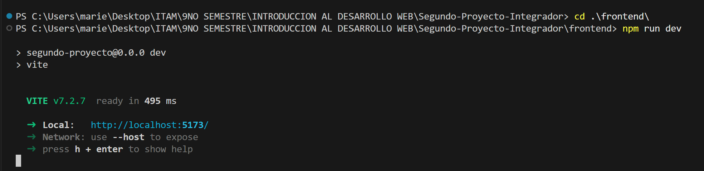

### Para correr el back
Dividiremos el proceso para correr el back en dos secciones: La preparación y los comandos.
#### Preparación
Seguir estas instrucciones en caso de que sea la primera vez que se usa la herramienta y no se tenga nada instalado.

1. Entrar a la página Unsplash https://unsplash.com/es 
2. Crear una cuenta con nombre, correo y contraseña
3. En menú, nos vamos al apartado de desarrolladores 
4. Damos clic en Your Apps

    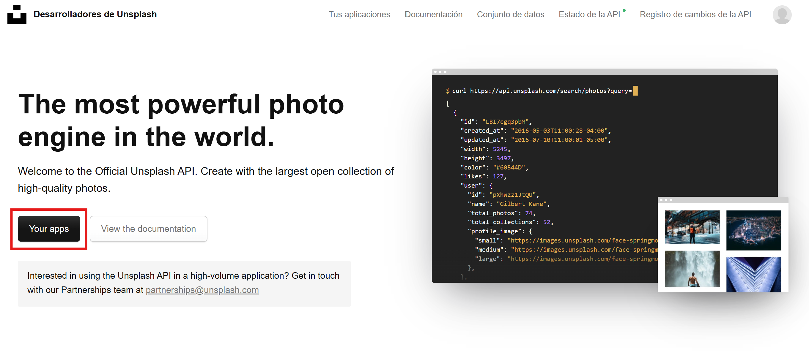

5. Damos clic en New Application y aceptamos los términos
6. Insertamos el nombre y una pequeña descripción de la aplicación, como se muestra en la siguiente imagen

    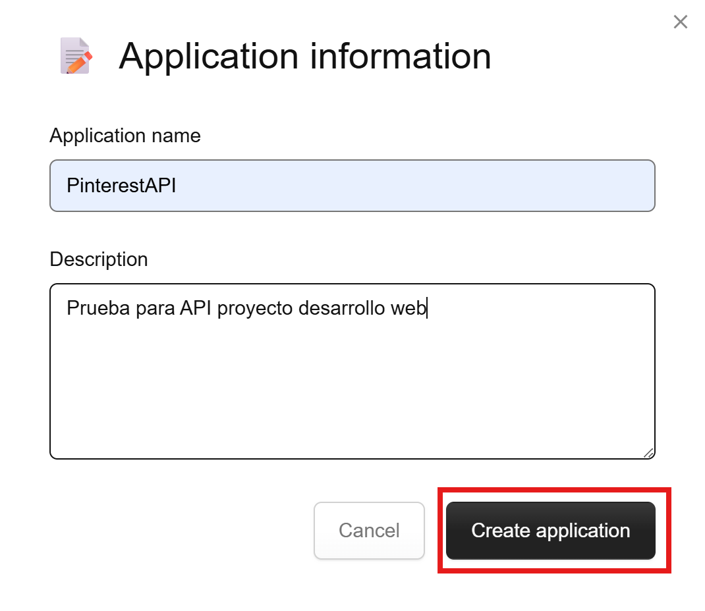

7. Nos vamos a la pestaña de Tus aplicaciones y damos clic en la aplicación que acabamos de crear

    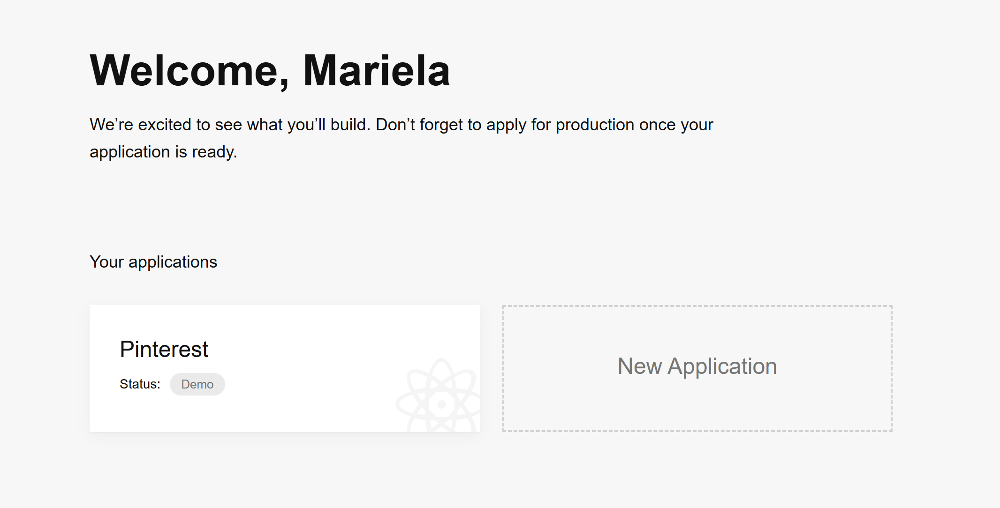

8. Dentro de ella, veremos un apartado llamado Keys y copiamos nuestra Access Key

    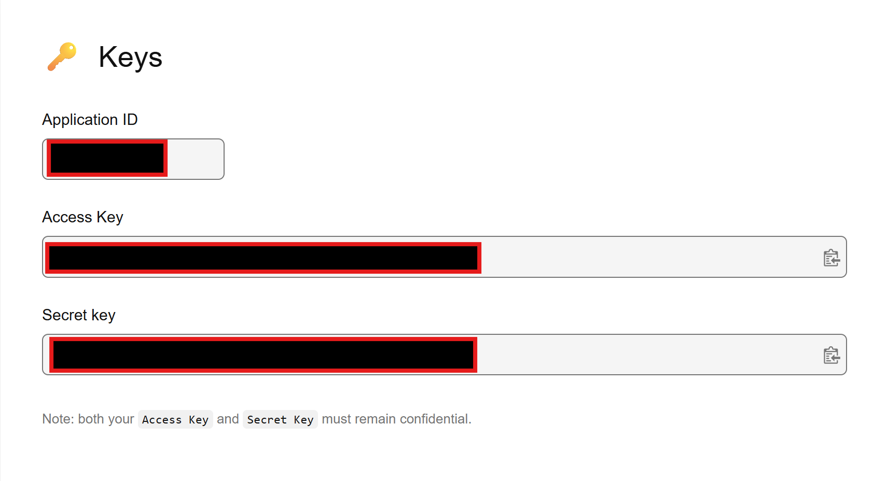

9. En nuestro vscode, en la carpeta de api creamos un nuevo documento llamado .env y en el escribiremos la siguiente línea: UNSPLASH_ACCESS_KEY = "access key", reemplazando access key por la key que copiamos en unsplash.
#### Dependencias (Back-end)
1. En la carpeta `api/` instala las dependencias del servidor:
   - `pip install -r requirements.txt`

#### Variables de entorno (Back-end)

#### Comandos 
1. En una terminal nueva (diferente a la que corrió el front-end), nos cambiamos a la carpeta de api: cd api
2. Corremos el comando python -m uvicorn main:app --reload --env-file .env
3. Una vez corriendo este último comando, vemos que nuestra página se verá algo así:

    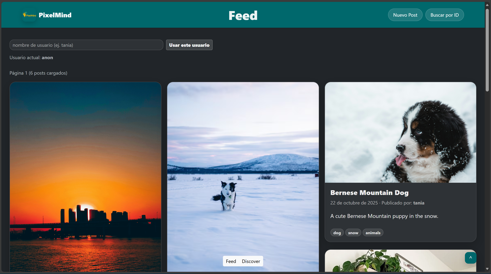

## Estructura del repositorio
- `frontend/`: aplicación web (React + Vite + Bootstrap).
- `api/`: servidor (FastAPI) con endpoints CRUD y endpoint de Discover (Unsplash).
- `imagenesReadME/`: imágenes utilizadas en este README.

## Proceso de elaboración del diseño (front-end)
Como se mencionó anteriormente, nuestra página fue nombrada "PixelMind" con el objetivo de fomentar la creatividad a través de la tecnología y crear un espacio donde los usuarios puedan guardar imágenes de inspiración y compartir ideas con otros por medio de sus propias imágenes. Para ello, el primer paso fue decidir la paleta de colores. Nos basamos en la psicología de los colores para elegir una combinación que resultara atractiva para los usuarios y que, al mismo tiempo, generara estímulos positivos en la mente, favoreciendo la creatividad y la inspiración.

Basándonos en la siguiente imagen, se eligieron los colores azul, amarillo y naranja.

    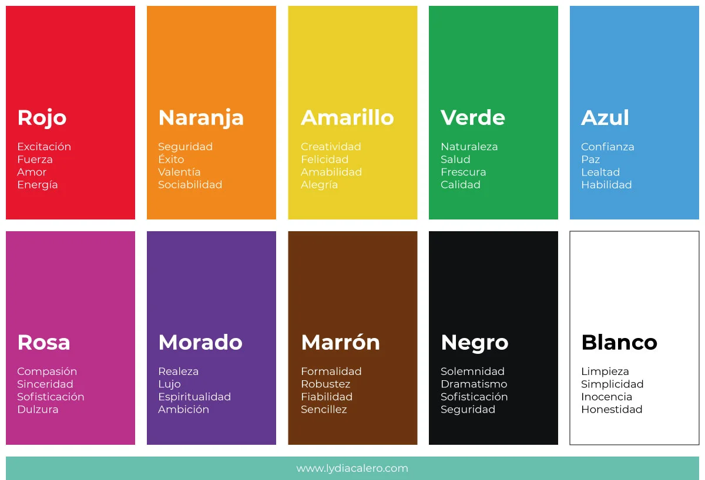

Paleta de colores obtenida

    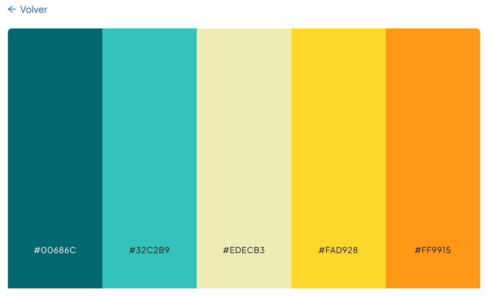

Una vez definidos los colores, pasamos al diseño gráfico de la interfaz. Para ello, nos auxiliamos de ChatGPT para la creación de una interfaz que fuera visualmente atractiva y ordenada (NOTA: No se utilizó para la elaboración del código, únicamente para generar una foto sobre cómo queríamos los diseños. Evidencia de la conversación: https://chatgpt.com/share/693b395e-ec80-8001-a9aa-a719a86f0ff5).

Logo utilizado 

    

<strong>Diseños de inspiración</strong>

Vista principal

    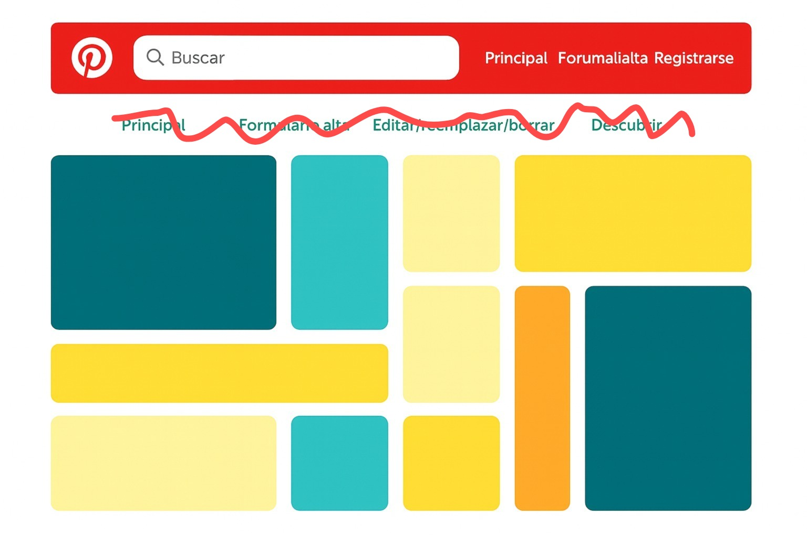

Vista formularios alta y edición

    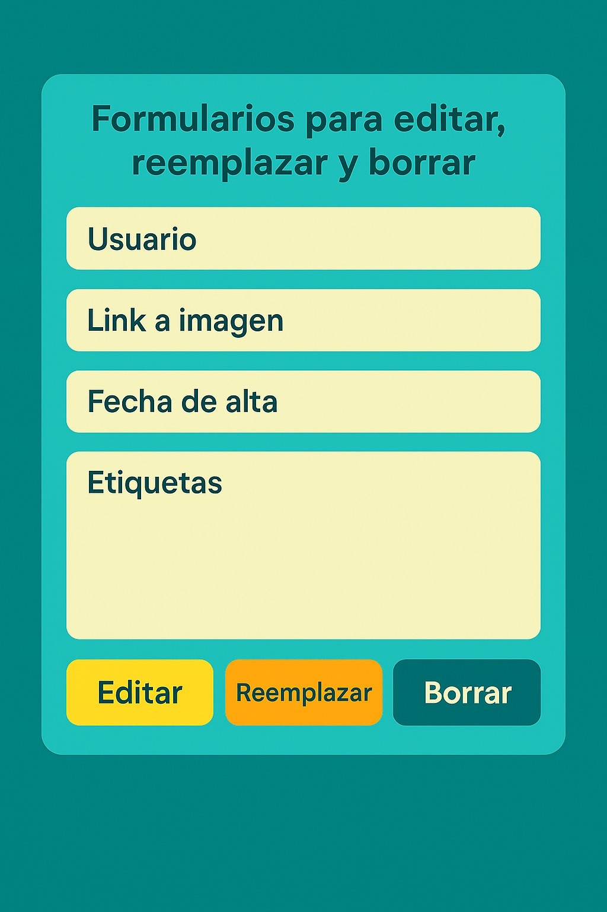

Vista descubrimiento 

    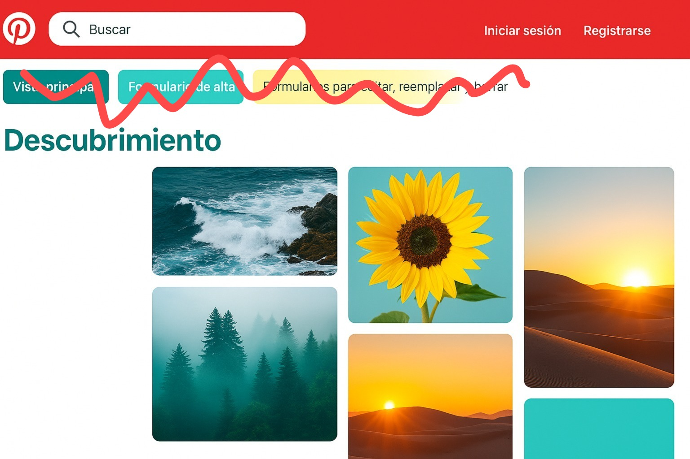

#### Nota
Este fue el diseño inicial, sin embargo, durante la elaboración de la página nos dimos cuenta que se veía muy cargado de colores. Por ello, se tomó la decisión de dejar únicamente el azul oscuro y se agrego un tono gris oscuro/negro para conservar el profesionalismo de nuestra página. 

## Proceso de elaboración del diseño (back-end)
El back-end se desarrolló con **FastAPI (Python)** con el objetivo de centralizar la lógica de negocio y evitar que el front-end dependa directamente de servicios externos. La API cumple dos funciones principales: (1) administrar los posts del usuario (CRUD) y (2) alimentar la sección de **Discover** consumiendo una API externa (Unsplash).

### 1) Arquitectura general
La aplicación se divide en dos partes:
- **Front-end** (React + Vite): renderiza la interfaz, muestra el feed tipo Pinterest y contiene formularios de alta/edición.
- **Back-end** (FastAPI): expone endpoints REST que el front consume con `fetch`, maneja persistencia (base de datos) y controla validaciones.

Esta separación permite que el front sea más ligero y que las reglas importantes queden concentradas en la API.

### 2) Endpoints implementados
La API expone endpoints que permiten:
- **Listar posts** con paginación (por ejemplo usando parámetros como `skip` y `limit`).
- **Obtener un post por id**.
- **Crear posts** a partir de la información enviada por el formulario.
- **Actualizar posts** (edición o reemplazo).
- **Eliminar posts**.

El objetivo es que el front-end no “invente” estados, sino que todo salga de la API como fuente única de verdad.

### 3) Persistencia de datos
Los posts se almacenan en una **base de datos**, lo que permite que:
- El contenido no se pierda al recargar la página.
- Distintos usuarios puedan ver un feed consistente.
- Se mantenga el historial de publicaciones y se puedan editar o borrar en cualquier momento.

### 4) Sección Discover con API externa (Unsplash)
Para la sección **Discover**, el back-end consume la API de **Unsplash** usando una `Access Key` guardada en un archivo `.env`.
En lugar de regresar la respuesta completa de Unsplash, el back-end **transforma** los datos y regresa únicamente lo necesario para la interfaz (por ejemplo: id, descripción y URL de imagen). Esto mantiene la respuesta más limpia y evita exponer información innecesaria.

### 5) Validación por usuario (seguridad)
Para las operaciones sensibles (**editar** y **borrar**), la API valida que el usuario que realiza la petición sea el mismo que creó el post.
- El front guarda el usuario actual (por ejemplo en `sessionStorage`) y lo envía en cada petición mediante el header `X-User`.
- Si el usuario no coincide con el dueño del post, la API rechaza la operación con un error **403 (Forbidden)**.

Esto asegura que ningún usuario pueda modificar o eliminar contenido que no le pertenece.

### 6) Integración con el front-end
El front-end se comunica con la API mediante `fetch` (GET/POST/PUT/DELETE). Con esto:
- Los formularios de alta/edición impactan directamente en la base de datos.
- El feed se actualiza consultando nuevamente la API (paginación).
- Discover se alimenta desde el endpoint propio del back-end, no desde Unsplash directamente.

##  Producto final
### Feed (vista principal)

  

### Alta de post

  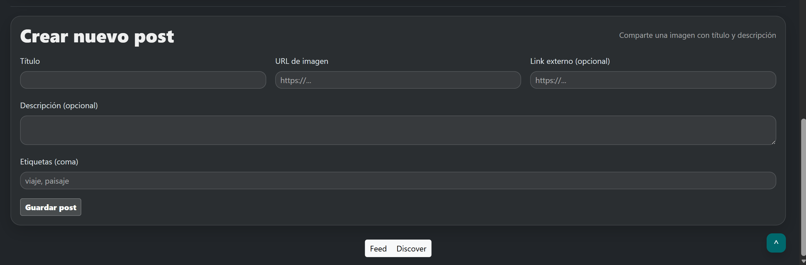

### Edición de post
Para esta parte, es necesario ser autor de una imagen, de otra manera, no dejará editar. 
Ejemplo: 

  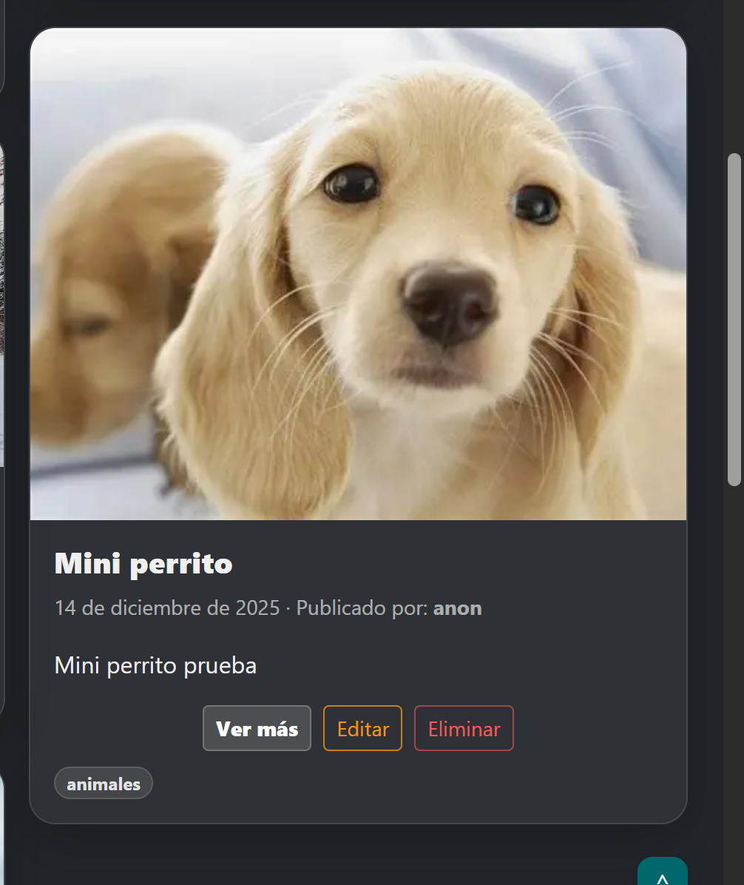

Posteriormente, damos clic en editar y nos despliega el siguiente formulario: 

  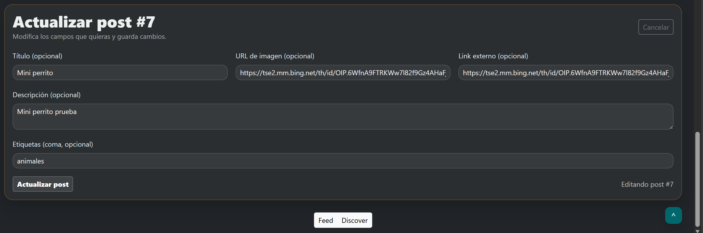

### Discover

  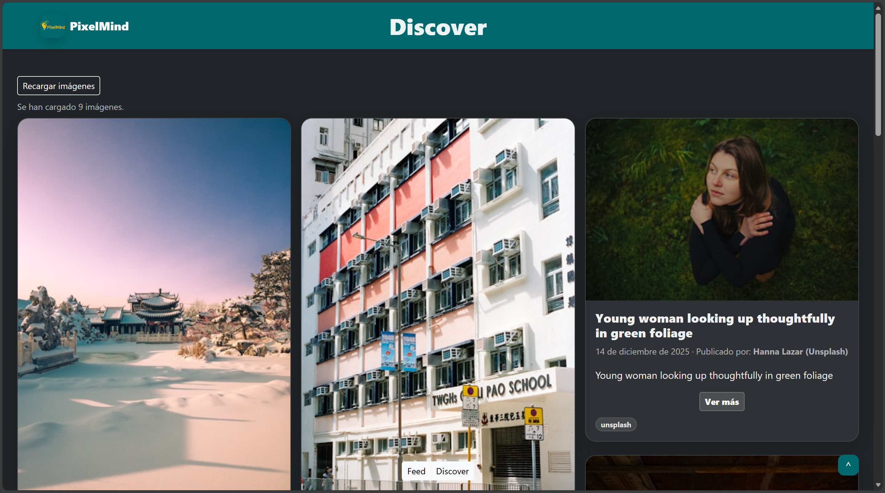

## Fuentes usadas
- Unsplash (API e imágenes): https://unsplash.com/es
- Conversación usada para inspiración de UI (no para código): https://chatgpt.com/share/693b395e-ec80-8001-a9aa-a719a86f0ff5
- Documentación:
  - React: https://react.dev/
  - Vite: https://vitejs.dev/
  - Bootstrap: https://getbootstrap.com/
  - FastAPI: https://fastapi.tiangolo.com/
  - Uvicorn: https://www.uvicorn.org/
